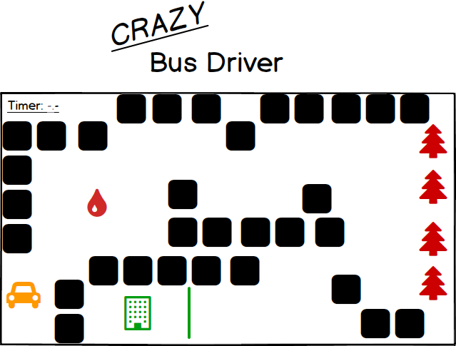
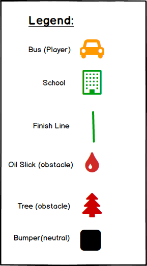

## Crazy Bus Driver

### Background

Crazy Bus Driver is a spin of the game 'Crazy Taxi' that was extremely popular years ago. However, in Crazy Bus Driver the view is a 2D, top-down landscape, and instead of delivering taxi customers, the player will need to escort school students to class on time -- or else you lose.

### Functionality & MVP

In Crazy Bus Driver, users will be able to:

- [ ] Control a vehicle with keyboard input
- [ ] Keep track of the time left to complete the round with a timer
- [ ] Traverse a game grid while avoiding obstacles that deter the vehicle

In addition, this project will include:

- [ ] A production ReadMe

### Wireframes

This app will consist of a single screen with a game board and game controls.

Game controls will include Left, Right, Forward, and Backward buttons to control the movement of the vehicle.

### Architecture and Technologies

This project will be implemented with the following technologies:

- Vanilla JavaScript for overall structure and game logic
- `HTML5 Canvas` for rendering,
- Webpack to bundle and serve up the various scripts.

In addition to the webpack entry file, there will be three scripts involved in this project:

`board.js`: this script will handle the logic for creating and updating the necessary grid elements and rendering them to the DOM.

`bus.js`: this script will handle the logic of rendering the bus and setting up the controls to manipulate its movement.

`obstacles.js`: this script will handle the logic of rendering various obstacles generated on the board, and their associated behavior.

### Implementation Timeline

**Day 1**: Setup all necessary Node modules, including getting webpack up and running. Create `webpack.config.js` as well as `package.json`.  Write a basic entry file and the bare bones of all 3 scripts outlined above.  

Goals for the day:

- Get a green bundle with `webpack`
- Learn more about `Canvas.js` and how to render objects to it, as well as how to render objects from other files.

**Day 2**: Dedicate this day to learning `Canvas.js`. Use `board.js` to create and render the square grid, `bus.js` to create and render the bus, and `obstacles.js` to create and render obstacles.

- Complete the `board.js`, `bus.js`, and `obstacles.js` modules (constructor, update functions)
- Render a square grid to the `Canvas`
- Render a bus to the board.

**Day 3**: Install the controls for the user to interact with the game. Add collision functions to the bus, grid, and obstacles, so that the bus responds to each of them.

Goals for the day:

- Create keyboard controls for the bus' movement.
- Have the bus detect collision with the grid, obstacles, and finish line.

**Day 4**: Add a finish line (with collision function as well) and timer that counts down. Style the frontend, making it polished and professional.  

Goals for the day:

- Generate a game over if the bus has not reached finish line before timer runs out, and game won message otherwise.
- Have a styled `Canvas`, nice looking controls and title

### Bonus features

Some additional features to be implemented:

- [ ] Add variation to the game with additional levels
- [ ] Add choice for game difficulty at onset of game
- [ ] Add power-up items to the bus
